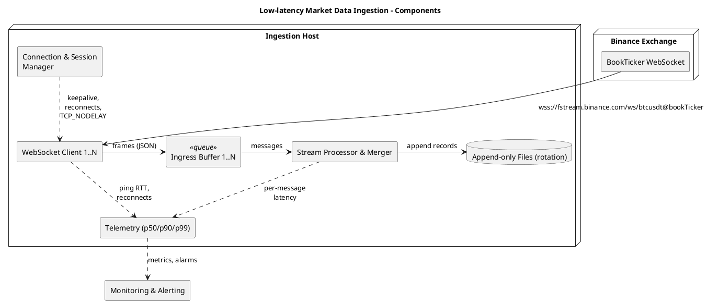
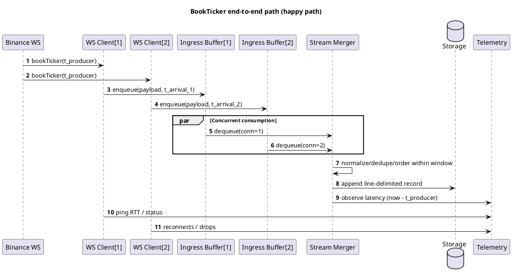
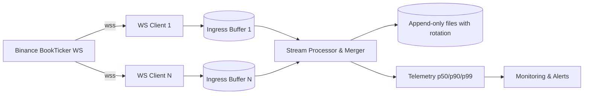

## Architecture: low-latency market data ingestion

Goal: receive every message from `wss://fstream.binance.com/ws/btcusdt@bookTicker` with the lowest possible latency, using N parallel connections, merging results into a single ordered stream, persisting to storage, and computing per-connection latency metrics.

### Core components (basics)

#### 1) Event producer (Binance exchange)
The exchange is the origin of book-ticker events. It continuously emits updates over WebSocket. Understanding the producer’s behavior and pacing is foundational to end-to-end latency design (event producers concept).

#### 2) Connection and session manager (N WebSocket clients)
Maintains N independent WebSocket sessions to the same endpoint to reduce head-of-line blocking risk between flows, isolate faults, and enable parallelism across CPU cores or hosts. Handles TLS handshakes, ping/pong keepalives, reconnects with jitter, and connection health checks. Efficient inter-service communication principles and judicious protocol choices inform this layer.

#### 3) Ingress buffer / message queue
Per-connection, a lightweight queue decouples network receive from downstream processing to avoid blocking and to absorb micro-bursts. This provides durability guarantees (when used with persistence) and backpressure signaling, and it enables horizontal scalability of consumers.

#### 4) Stream processing and merger
Consumes messages from all connections, normalizes/validates payloads, orders updates, removes duplicates, and produces a single coherent output stream. Optionally performs lightweight aggregations or joins if needed for downstream analytics.

#### 5) Data storage
Persists the unified stream. Baseline: append-only files with rotation for simplicity and auditability. For low-latency reads or fan-out, pair with in-memory caches; for long-term retention or large-scale analytics, use persistent stores designed for write-heavy, scalable workloads.

#### 6) Latency measurement and telemetry
Records per-message arrival timestamps and computes latency relative to producer timestamps when available. Emits rolling percentiles (p50/p90/p99), counts, and tail-latency alarms per connection and for the merged stream. These metrics are essential for verifying that optimizations actually reduce latency.

#### 7) Monitoring, logging, and alerting
Collects system health KPIs (message lag, drop rates, reconnects, queue depth, CPU/NET saturation) and application logs. Establishes SLOs and alerts to quickly surface degradations and regressions.

#### 8) Load distribution and scaling
Distributes WebSocket sessions across CPU cores, processes, or hosts, and—if needed—across regions. A load balancer or orchestration strategy spreads traffic, prevents hotspots, and supports failover.

#### 9) Communication protocol and serialization considerations
Favor wire-efficient, low-overhead communication. Binary encodings and compact schemas reduce serialization/deserialization overhead and payload size where applicable. While the upstream is WebSocket, downstream and internal hops should still follow low-latency protocol and serialization best practices.

### Alignment with `task.md`
- N WebSocket connections → Connection and session manager (component 2)
- Merge/aggregate incoming data → Stream processing and merger (component 4)
- Save the stream to file → Data storage (component 5)
- Calculate per-connection latency metrics → Latency measurement and telemetry (component 6)

### Minimal MVP (ready libraries, no code)

Goal: deliver a working baseline quickly, measure p50/p90/p99, then iterate.

- Connection & session manager
  - Library: Boost.Asio + Boost.Beast (WebSocket over TLS). Alternative: uWebSockets, websocketpp.
  - Start with N = 2–4 connections in one reactor/event-loop thread pinned to one CPU core.
  - Settings: TCP_NODELAY, disable per-message compression, sane ping/pong intervals, exponential backoff with jitter for reconnects.
  - Time source: monotonic for intervals; wall clock synchronized (chrony/ntp) for absolute times.

- Ingress buffer
  - Per-connection queue. Prefer SPSC ring if each connection has a dedicated consumer; otherwise MPSC such as a bounded concurrent queue.
  - Preallocate capacity to avoid allocations; track depth as a metric. Backpressure policy: drop/slow-path only under extreme conditions.

- Stream processing & merger
  - Single consumer thread reads from all ingress buffers, normalizes payloads, deduplicates, orders within a small time/sequence window, and emits a unified stream.
  - Ordering key: exchange sequence/update id where available; otherwise arrival time with small reordering window.

- Data storage
  - Append-only file with rotation (size or time). Line-delimited records for simplicity at MVP.
  - Buffered I/O with periodic fsync; record minimal fields needed for later analysis.

- Latency measurement & telemetry
  - For each message: record arrival timestamp and compute latency vs producer timestamp (e.g., data['T'] if provided).
  - Emit rolling p50/p90/p99 and count per connection and merged stream every 1s; track reconnects, queue depths, ping RTT.

- Monitoring & logging
  - Start with structured logs to stdout; optionally expose Prometheus metrics later.
  - Alerts (later): tail-latency and reconnect rate thresholds.

- Load distribution & scaling
  - Begin with one reactor thread handling all connections. If CPU-bound, add a second reactor and split connections; pin threads to distinct cores.
  - Optionally spread across hosts/regions after local MVP is validated.

### MVP test plan (no code)

- Baseline runs: measure for 5–10 minutes with N ∈ {1, 2, 4}.
- Metrics to record: per-connection and merged p50/p90/p99, drops (if any), queue depths, reconnects, CPU usage.
- Compare against the provided Python baseline to quantify improvements.
- Validate stability during market micro-bursts (watch queue depth and p99/p999 behavior).

### References
- Event producers in distributed event processing: [Architecting a Distributed Event Processing System (Coudo.ai)](https://www.coudo.ai/blog/architecting-a-distributed-event-processing-system-lld-strategies?utm_source=openai)
- Message queues for decoupling and reliability; low-latency system design: [How to Architect a Low-Latency Architecture for Real-Time Applications (Hogonext)](https://hogonext.com/how-to-architect-a-low-latency-architecture-for-real-time-applications/?utm_source=openai)
- Stream processing engines for real-time pipelines: [Apache Samza (Wikipedia)](https://en.wikipedia.org/wiki/Apache_Samza?utm_source=openai)
- Data storage choices for low-latency and persistence: [Low-Latency Architecture Storage Options (Hogonext)](https://hogonext.com/how-to-architect-a-low-latency-architecture-for-real-time-applications/?utm_source=openai)
- Efficient inter-service communication with binary protocols: [4 Pillars of Low Latency in Microservices (Medium)](https://medium.com/%40ppiyush/4-pillars-of-low-latency-in-microservices-unlocking-efficiency-12a35c96e8b8?utm_source=openai)
- Load balancing to prevent hotspots and reduce latency: [Low-Latency in System Design (Educative.io)](https://www.educative.io/blog/low-latency-in-system-design?utm_source=openai)
- Monitoring, metrics, and alerting in stream systems: [Stream Processing System Design & Architecture (GeeksforGeeks)](https://www.geeksforgeeks.org/stream-processing-system-design-architecture/?utm_source=openai)
 - Practices for I/O buffering and batching: [Буферизация и пакетирование (Habr)](https://habr.com/ru/companies/otus/articles/923760/?utm_source=openai)
 - System design trade-offs and load balancing: [Балансировка нагрузки, кеширование (Habr)](https://habr.com/ru/companies/otus/articles/912286/?utm_source=openai)
 - Language/tooling trade-offs for low-latency systems: [Почему Java иногда не хуже C++ (Habr)](https://habr.com/ru/companies/piter/articles/586870/?utm_source=openai)
 - Concepts overview and further learning: [System Design Course Overview (Balun.courses)](https://balun.courses/courses/system_design?utm_source=openai)
 - Additional reading index (systems/performance posts): [machow.ski posts](https://www.machow.ski/posts/)

### Miro-ready diagrams

The best fit for this system now:
- **UML component diagram**: shows structure and responsibilities.
- **UML sequence diagram**: shows the end-to-end latency path per message.
- **Flowchart (optional)**: quick pipeline overview.
- ERD / Mindmap: not needed for the current MVP.

#### PlantUML — Component diagram

#### PlantUML — Sequence diagram

#### Mermaid — Flowchart (pipeline overview)

#### Paste into Miro

- **PlantUML**: Install the PlantUML Diagrams app → click it → paste any snippet above (between `@startuml` and `@enduml`) → Add to board.
- **Mermaid**: Install the Mermaid Diagrams app → click it → paste the Mermaid snippet → Add to board.
- **Tip**: After insertion, zoom to fit and resize for readability. For the sequence diagram, widen the canvas if labels wrap.
